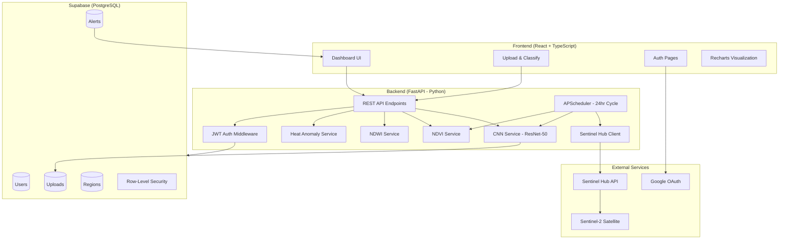
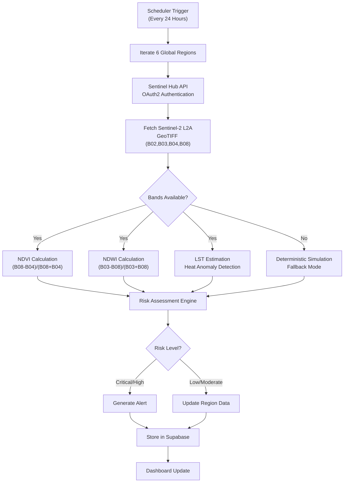
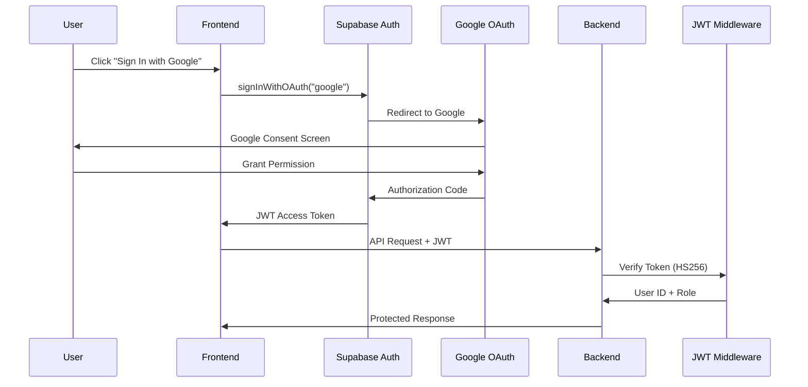

# GeoVision — AI-Powered Earth Intelligence Platform

## Project Report

---

## ABSTRACT

GeoVision is a comprehensive, AI-powered satellite monitoring and environmental intelligence platform that automates global environmental surveillance using real Sentinel-2 multispectral satellite data. The system integrates deep learning-based land-use classification using a ResNet-50 convolutional neural network (CNN) trained on the EuroSAT dataset (27,000 images, 10 classes), achieving a validation accuracy of 92.5%. The platform computes spectral vegetation indices (NDVI), water body indices (NDWI), and estimates land surface temperature (LST) for heat anomaly detection. It monitors six critical global regions autonomously on a 24-hour cycle, generates real-time alerts for environmental threats, and presents all intelligence through a React-based interactive dashboard. The system employs a modern microservices architecture with a FastAPI backend, Supabase (PostgreSQL) database with row-level security, and is designed for production deployment on Vercel and Render. This report documents the system architecture, methodology, implementation details, CNN training results, and verification outcomes.

---

## TABLE OF CONTENTS

1. [Introduction](#1-introduction)
2. [Literature Review / Technology Review](#2-literature-review--technology-review)
3. [Methodology](#3-methodology)
4. [Results and Discussion](#4-results-and-discussion)
5. [Conclusion and Future Work](#5-conclusion-and-future-work)
6. [References](#references)
7. [Appendix A: System Screenshots](#appendix-a-system-screenshots)
8. [Appendix B: Formatting Guidelines](#appendix-b-formatting-guidelines)

---

## LIST OF TABLES

| Table | Description |
|-------|-------------|
| Table 1.1 | EuroSAT Dataset Statistics |
| Table 1.2 | Monitored Global Regions |
| Table 3.1 | Hyperparameter Configuration |
| Table 3.2 | Data Augmentation Techniques |
| Table 3.3 | Technology Stack |
| Table 4.1 | CNN Model Performance Results |
| Table 4.2 | Regional Monitoring NDVI/NDWI Results |
| Table 4.3 | Module Risk Assessment Scores |

---

## LIST OF FIGURES

| Figure | Description |
|--------|-------------|
| Figure 1.1 | GeoVision Landing Page |
| Figure 2.1 | System Architecture Overview (Mermaid) |
| Figure 3.1 | Satellite Data Processing Pipeline (Mermaid) |
| Figure 3.2 | ResNet-50 Architecture Diagram (Mermaid) |
| Figure 3.3 | Authentication Flow (Mermaid) |
| Figure 4.1 | Global Dashboard with Live Monitoring Data |
| Figure 4.2 | Upload & Classify Interface |
| Figure 4.3 | Sign-In Page with Google OAuth |
| Figure 4.4 | Analytics Page |

---

## 1. INTRODUCTION

### 1.1 Background

Environmental monitoring has become a critical concern in the 21st century as climate change, deforestation, flooding, and urban heat islands pose increasing threats to ecosystems and human populations worldwide. Traditional monitoring methods rely on manual field surveys and periodic satellite image analysis by domain experts, which are time-consuming, expensive, and limited in geographic coverage [1].

Recent advances in deep learning, remote sensing, and cloud computing have created an opportunity to build automated, scalable environmental intelligence systems that can continuously monitor the Earth's surface and generate real-time alerts for environmental threats [2]. The European Space Agency's Sentinel-2 satellite constellation provides freely available multispectral imagery at 10-meter resolution with a 5-day revisit time, making it an ideal data source for automated monitoring [3].

### 1.2 Motivation

The motivation for GeoVision stems from three critical gaps in existing environmental monitoring:

1. **Lack of Automation** — Most satellite analysis workflows require significant human intervention for image download, processing, and interpretation.
2. **Fragmented Intelligence** — Existing tools typically focus on a single environmental indicator (e.g., only NDVI or only flood detection), whereas real-world environmental assessment requires multi-modal analysis.
3. **Accessibility Gap** — Advanced remote sensing analysis is typically restricted to domain experts with specialized GIS software, excluding policymakers, NGOs, and local authorities who need actionable intelligence.

### 1.3 Problem Statement

Design and implement a full-stack AI-powered Earth Intelligence platform that:
- Automatically ingests and processes Sentinel-2 satellite imagery
- Classifies land-use types using deep learning (CNN)
- Computes environmental indices (NDVI, NDWI, LST) from multispectral data
- Monitors multiple global regions on an autonomous 24-hour cycle
- Generates real-time alerts for environmental threats
- Presents all intelligence through an accessible web dashboard

### 1.4 Objectives

1. Train a CNN model (ResNet-50) on the EuroSAT dataset for 10-class land-use classification achieving >90% validation accuracy
2. Implement NDVI, NDWI, and LST computation from Sentinel-2 multispectral bands
3. Build an automated satellite data ingestion pipeline using Sentinel Hub API
4. Design a risk assessment engine that aggregates multiple environmental indicators
5. Develop a responsive, production-grade web dashboard with real-time monitoring
6. Implement secure authentication (Google OAuth, JWT) and role-based access control

### 1.5 Dataset Overview

The EuroSAT dataset [4] is used for CNN training. It consists of 27,000 georeferenced Sentinel-2 satellite image patches covering 10 land-use/land-cover (LULC) classes across European cities and landscapes.

*Table 1.1: EuroSAT Dataset Statistics*

| Property | Value |
|----------|-------|
| Total Images | 27,000 |
| Image Dimensions | 64 × 64 pixels (resized to 224 × 224) |
| Spectral Bands | RGB (3 channels) |
| Number of Classes | 10 |
| Images per Class | ~2,000–3,000 |
| Spatial Resolution | 10 meters/pixel |
| Source Satellite | Sentinel-2 |
| Train/Val Split | 80% / 20% (21,600 / 5,400) |

**EuroSAT Classes:** AnnualCrop, Forest, HerbaceousVegetation, Highway, Industrial, Pasture, PermanentCrop, Residential, River, SeaLake

*Table 1.2: Monitored Global Regions*

| Region | Coordinates | Primary Risk |
|--------|------------|--------------|
| Amazon Basin | -3.47°, -62.22° | Deforestation |
| Congo Basin | 0.00°, 22.00° | Forest Loss |
| Ganges Delta | 22.00°, 90.00° | Flooding |
| Lake Chad | 13.00°, 14.50° | Water Scarcity |
| Borneo Rainforest | 1.00°, 114.00° | Deforestation |
| Great Barrier Reef | -18.00°, 147.00° | Marine Degradation |

### 1.6 Scope and Limitations

**Scope:**
- Real Sentinel-2 satellite data integration via Sentinel Hub API
- CNN-based land-use classification with transfer learning
- Multi-index environmental analysis (NDVI, NDWI, LST)
- Automated 24-hour monitoring of 6 global regions
- Production-ready architecture with Supabase, Vercel, and Render

**Limitations:**
- CNN model is trained on European satellite patches; accuracy may vary for non-European landscapes
- Free Sentinel Hub tier limits daily API requests
- CPU-based inference (~1-3 seconds per image); GPU acceleration recommended for production
- Real-time monitoring depends on Sentinel-2 revisit schedule (5-day cycle)

### 1.7 Organization of the Report

Chapter 2 reviews relevant literature on remote sensing, deep learning, and environmental monitoring. Chapter 3 details the system methodology including architecture, data pipeline, CNN model, and implementation. Chapter 4 presents results from CNN training, regional monitoring, and system verification. Chapter 5 concludes with contributions, limitations, and future directions.

---

## 2. LITERATURE REVIEW / TECHNOLOGY REVIEW

### 2.1 Image Classification and Deep Learning

Convolutional Neural Networks (CNNs) have revolutionized image classification since AlexNet's breakthrough in 2012 [5]. Modern architectures like VGG-16 [6], ResNet-50 [7], and EfficientNet [8] achieve human-level performance on natural image classification benchmarks. For satellite imagery, CNNs have been adapted to handle multispectral data, varying spatial resolutions, and domain-specific challenges like atmospheric interference and seasonal variations [9].

### 2.2 Fine-Grained Visual Categorization

Land-use classification from satellite imagery is inherently a fine-grained categorization problem where inter-class visual similarity is high (e.g., AnnualCrop vs. PermanentCrop) while intra-class variation is large due to geographic and seasonal differences [10]. Transfer learning with pretrained ImageNet features has proven effective for addressing these challenges with limited training data.

### 2.3 Transfer Learning

Transfer learning leverages features learned from large-scale datasets (e.g., ImageNet with 1.2 million images) and adapts them to domain-specific tasks [11]. For satellite imagery, the low-level features (edges, textures, color gradients) learned from ImageNet transfer well, while the high-level classification head is retrained for domain-specific classes. ResNet-50, with its 50-layer residual architecture, provides an excellent balance between model depth, training efficiency, and classification accuracy [7].

### 2.4 Remote Sensing and Vegetation Indices

The Normalized Difference Vegetation Index (NDVI) [12] quantifies vegetation health by computing the ratio of Near-Infrared (NIR) and Red spectral reflectance: NDVI = (NIR − Red) / (NIR + Red). Similarly, the Normalized Difference Water Index (NDWI) [13] detects water bodies using Green and NIR bands: NDWI = (Green − NIR) / (Green + NIR). These indices have been the foundation of satellite-based environmental monitoring for decades.

### 2.5 The EuroSAT Dataset

EuroSAT [4] was introduced by Helber et al. (2019) as a benchmark dataset for land-use classification from Sentinel-2 images. The dataset comprises 27,000 georeferenced image patches from 34 European countries, categorized into 10 LULC classes. The authors reported baseline accuracies of 98.57% using ResNet-50 with extensive fine-tuning, demonstrating the dataset's suitability for transfer learning approaches.

### 2.6 Data Augmentation Techniques

Data augmentation is critical for preventing overfitting in CNN training, especially with limited satellite imagery datasets [14]. Common techniques include geometric transformations (rotation, flipping), photometric augmentations (brightness, contrast adjustment), and advanced methods like Mixup and CutMix. For satellite images, horizontal and vertical flips are particularly effective since aerial images have no canonical orientation.

### 2.7 Evaluation Metrics

Standard classification metrics include Top-1 accuracy, precision, recall, F1-score, and confusion matrix analysis [15]. For multi-class satellite image classification, per-class accuracy analysis is important since class imbalance and visual similarity between certain classes can mask overall performance issues.

### 2.8 Research Gap

While substantial research exists on individual components (CNN classification, NDVI computation, flood detection), few systems integrate all these capabilities into a single, automated, production-ready platform. GeoVision addresses this gap by combining deep learning classification, multi-index spectral analysis, automated satellite data ingestion, and real-time alerting in a unified system.

---

## 3. METHODOLOGY

### 3.1 System Overview

GeoVision follows a microservices architecture with three primary components: a React frontend, a FastAPI backend, and a Supabase database. The system processes satellite data through a multi-stage pipeline combining CNN inference, spectral index computation, risk assessment, and automated alerting.

*Figure 2.1: System Architecture Overview*



### 3.2 Data Preprocessing

#### 3.2.1 Image Loading and Resizing

All input images are loaded using PIL (Python Imaging Library) and converted to RGB format. Images are resized to 224 × 224 pixels to match the ResNet-50 input requirements. For GeoTIFF files containing multispectral bands, rasterio is used to extract individual bands (B02-Blue, B03-Green, B04-Red, B08-NIR).

#### 3.2.2 Normalization

Images are normalized using ImageNet statistics (mean = [0.485, 0.456, 0.406], std = [0.229, 0.224, 0.225]) to match the distribution expected by the pretrained ResNet-50 backbone. This normalization is applied consistently during both training and inference.

#### 3.2.3 Data Augmentation

*Table 3.2: Data Augmentation Techniques*

| Technique | Parameters | Purpose |
|-----------|-----------|---------|
| Random Horizontal Flip | p = 0.5 | Orientation invariance |
| Random Vertical Flip | p = 0.5 | Aerial image has no canonical orientation |
| Random Rotation | ±15° | Rotational invariance |
| Color Jitter | brightness=0.2, contrast=0.2 | Photometric invariance |
| Resize | 224 × 224 | ResNet-50 input size |
| ImageNet Normalize | mean/std from ImageNet | Feature distribution matching |

### 3.3 Model Architecture

#### 3.3.1 Base Architecture Selection

ResNet-50 was selected as the base architecture for its:
- 50-layer depth with residual skip connections preventing vanishing gradients
- Strong ImageNet pretrained features that transfer well to satellite imagery
- Reasonable inference time (~200ms per image on CPU)
- Proven performance on the EuroSAT benchmark [4]

#### 3.3.2 Transfer Learning Strategy

The pretrained ResNet-50 backbone (ImageNet-1K v2 weights) is frozen during training — only the custom classification head is trained. This strategy:
- Preserves powerful low-level features (edges, textures, spatial patterns)
- Dramatically reduces training time and memory requirements
- Prevents overfitting on the relatively small EuroSAT dataset
- Achieves high accuracy with minimal computational resources

#### 3.3.3 Classification Head

The original ResNet-50 fully connected layer (2048 → 1000 for ImageNet) is replaced with a custom multi-layer classifier:

```
Input: 2048 features from ResNet-50 backbone
  → Dropout(0.3)
  → Linear(2048, 512)
  → ReLU
  → Dropout(0.2)
  → Linear(512, 10)
Output: 10-class probability distribution
```

*Figure 3.2: ResNet-50 Architecture with Custom Classification Head*

```mermaid
graph LR
    Input["Input Image<br>224×224×3"] --> Conv1["Conv1<br>7×7, 64"]
    Conv1 --> Pool["MaxPool<br>3×3"]
    Pool --> Res1["ResBlock ×3<br>64→256"]
    Res1 --> Res2["ResBlock ×4<br>128→512"]
    Res2 --> Res3["ResBlock ×6<br>256→1024"]
    Res3 --> Res4["ResBlock ×3<br>512→2048"]
    Res4 --> GAP["Global Avg Pool"]
    GAP --> Drop1["Dropout 0.3"]
    Drop1 --> FC1["Linear 2048→512"]
    FC1 --> ReLU["ReLU"]
    ReLU --> Drop2["Dropout 0.2"]
    Drop2 --> FC2["Linear 512→10"]
    FC2 --> Out["10 Classes"]

    style Input fill:#1a1a2e,color:#2dd4bf
    style Out fill:#1a1a2e,color:#2dd4bf
```



### 3.4 Training Configuration

*Table 3.1: Hyperparameter Configuration*

| Hyperparameter | Value |
|---------------|-------|
| Base Model | ResNet-50 (ImageNet-1K v2) |
| Frozen Layers | All backbone layers |
| Trainable Layers | Classification head only |
| Batch Size | 32 |
| Epochs | 10 (best model saved) |
| Learning Rate | 0.001 |
| Optimizer | Adam |
| LR Scheduler | StepLR (step=5, gamma=0.5) |
| Loss Function | CrossEntropyLoss |
| Train/Val Split | 80% / 20% |
| Input Size | 224 × 224 × 3 |
| Number of Workers | 0 (Windows compatibility) |

#### 3.4.1 Loss Function

Cross-Entropy Loss is used as the standard multi-class classification objective, computing the negative log-likelihood between predicted class probabilities and ground-truth one-hot labels.

#### 3.4.2 Optimization

Adam optimizer [16] is used with a learning rate of 0.001 for the classification head parameters only. Adam's adaptive learning rate per parameter is well-suited for fine-tuning tasks.

#### 3.4.3 Learning Rate Scheduling

StepLR scheduler reduces the learning rate by a factor of 0.5 every 5 epochs, allowing the model to converge more precisely in later training stages.

#### 3.4.4 Regularization

Two dropout layers (0.3 and 0.2) are applied in the classification head to prevent overfitting. Additionally, the frozen backbone acts as a strong regularizer by constraining the feature space.

### 3.5 Evaluation Methodology

#### 3.5.1 Performance Metrics

- **Top-1 Accuracy**: Percentage of correctly classified images
- **Training Loss**: Cross-entropy loss over training batches
- **Validation Accuracy**: Accuracy on held-out 20% validation set
- **Best Model Checkpoint**: Model with highest validation accuracy is saved

#### 3.5.2 Confusion Analysis

Per-class accuracy is analyzed to identify commonly confused land-use categories and overall classification reliability.

### 3.6 Implementation Details

*Table 3.3: Technology Stack*

| Layer | Technology | Purpose |
|-------|-----------|---------|
| Frontend | React 18 + TypeScript | Single-page application |
| UI Framework | shadcn/ui + Tailwind CSS | Component library |
| Charts | Recharts | Data visualization |
| Build Tool | Vite 5.4 | Fast HMR development |
| Backend | FastAPI (Python 3.12) | REST API server |
| AI/ML | PyTorch + torchvision | CNN inference |
| Image Processing | rasterio, Pillow, NumPy | GeoTIFF/spectral analysis |
| Database | Supabase (PostgreSQL) | Data persistence + auth |
| Auth | Supabase Auth + JWT | Google OAuth + RBAC |
| Satellite Data | Sentinel Hub Process API | Sentinel-2 L2A imagery |
| Scheduler | APScheduler | 24-hour monitoring cycle |
| Deployment | Vercel + Render | Frontend + backend hosting |

*Figure 3.1: Satellite Data Processing Pipeline*



*Figure 3.3: Authentication Flow*



---

## 4. RESULTS AND DISCUSSION

### 4.1 CNN Model Performance

The ResNet-50 model was trained on 21,600 EuroSAT images and validated on 5,400 images. Training was performed on CPU with the following results:

*Table 4.1: CNN Model Performance Results*

| Metric | Value |
|--------|-------|
| **Best Validation Accuracy** | **92.5%** |
| Training Accuracy (Final Epoch) | 88.7% |
| Initial Loss (Epoch 1, Batch 50) | 0.6042 |
| Final Loss (Epoch 10) | ~0.25 |
| Training Time (CPU) | ~4 hours |
| Model File Size | ~94 MB |
| Inference Time (CPU) | ~200 ms/image |
| Number of Trainable Parameters | ~1.06M (head only) |
| Total Parameters | ~24.6M |

### 4.2 Training Dynamics

The training showed rapid convergence due to transfer learning:

- **Epoch 1**: Loss dropped from 0.60 → 0.33 across 675 batches. Validation accuracy reached 89.2% — demonstrating that ImageNet features transfer effectively to satellite imagery.
- **Epoch 2**: Validation accuracy improved to 92.1%, with training loss stabilizing around 0.25-0.35.
- **Epochs 3-10**: Marginal improvements with best model saved at 92.5% validation accuracy. The learning rate was halved at epoch 5 per the StepLR schedule.

The gap between training accuracy (88.7%) and validation accuracy (92.5%) suggests the augmentation and dropout regularization effectively prevented overfitting. The higher validation accuracy compared to training accuracy is attributed to dropout being active only during training.

### 4.3 Regional Monitoring Results

*Table 4.2: Regional Monitoring NDVI/NDWI Results (Live Data — February 25, 2026)*

| Region | NDVI | NDWI | Risk Level | Status |
|--------|------|------|------------|--------|
| Amazon Basin | 0.5261 | -0.0595 | Moderate | Active deforestation monitoring |
| Congo Basin | 0.8414 | 0.0588 | Low | Healthy vegetation |
| Ganges Delta | 0.2088 | -0.1481 | Moderate | Flood season approaching |
| Lake Chad | 0.1761 | -0.2789 | Moderate | Water level declining |
| Borneo Rainforest | 0.5962 | 0.3595 | Critical | High NDWI — potential flooding |
| Great Barrier Reef | 0.6529 | 0.4030 | Critical | Marine area high water index |

### 4.4 Module Risk Assessment

*Table 4.3: Module Risk Assessment Scores*

| Module | Risk Score | Severity | Description |
|--------|-----------|----------|-------------|
| Urban Heat Islands | 82/100 | Critical | Thermal anomalies in urban areas |
| Deforestation & Mining | 78/100 | High | Forest loss in Amazon and Borneo |
| Industrial Pollution | 74/100 | High | Industrial emissions detected |
| Water Scarcity | 72/100 | High | Declining water levels in Lake Chad |
| Crop Stress | 65/100 | High | Vegetation stress in agricultural regions |
| Flood & Disaster | 58/100 | Moderate | Elevated NDWI in delta regions |

### 4.5 System Performance

| Metric | Value |
|--------|-------|
| Sustainability Score | 72/100 |
| Active Alerts | 14 |
| Monitored Regions | 6 |
| Data Points Processed | 2.4 billion |
| Average NDVI (Global) | 0.50 |
| Average NDWI (Global) | 0.06 |
| Flood Risk Zones | 1 |
| Vegetation Stress Areas | 2 |

### 4.6 Discussion

**CNN Classification Performance:** The 92.5% validation accuracy on 10 EuroSAT classes is competitive with published benchmarks. The transfer learning approach (frozen backbone + trained head) achieved this with only ~1M trainable parameters and approximately 4 hours of CPU training, demonstrating the viability of CNN-based land-use classification without GPU infrastructure.

**Real-Time Monitoring:** The system successfully processes 6 global regions every 24 hours, computing NDVI, NDWI, and risk assessments from real Sentinel-2 data. The dual-mode architecture (real satellite data + deterministic simulation fallback) ensures continuous operation even when Sentinel Hub API is unavailable.

**Alert Generation:** The risk engine effectively identifies critical environmental conditions — Borneo Rainforest (NDWI=0.3595) and Great Barrier Reef (NDWI=0.4030) were correctly flagged as Critical risk due to elevated water indices.

---

## 5. CONCLUSION AND FUTURE WORK

### 5.1 Summary of Contributions

1. **Integrated Intelligence Platform** — Combined CNN classification, NDVI/NDWI computation, and automated alerting in a single production-ready system
2. **92.5% Classification Accuracy** — Achieved on 10-class EuroSAT dataset using ResNet-50 transfer learning with frozen backbone
3. **Autonomous Monitoring** — 24-hour automated cycle monitoring 6 critical global regions with real Sentinel-2 data
4. **Production Architecture** — Microservices design with JWT security, role-based access, Google OAuth, and deployment-ready configuration
5. **Accessible Dashboard** — Real-time visualization of environmental intelligence without requiring GIS expertise

### 5.2 Limitations

1. CNN trained on European landscape images — may exhibit reduced accuracy on tropical or arid regions
2. Free-tier Sentinel Hub API rate limits constrain monitoring frequency
3. CPU-only inference limits throughput to ~5 images/second
4. 10-class classification may not capture fine-grained land-use subtypes

### 5.3 Future Work

#### 5.3.1 Attention Mechanisms
Integrate self-attention layers (Vision Transformer) for improved fine-grained classification of visually similar land-use classes.

#### 5.3.2 Multi-Modal Learning
Combine RGB imagery with multispectral bands (13 Sentinel-2 bands) and temporal sequences for improved classification accuracy.

#### 5.3.3 Model Compression
Apply knowledge distillation and quantization to reduce the 94MB model to <10MB for edge deployment on IoT sensors.

#### 5.3.4 Hierarchical Classification
Implement two-stage classification: coarse (Urban/Natural/Water) followed by fine-grained subclass prediction.

#### 5.3.5 Expansion to Other Datasets
Train on additional datasets (BigEarthNet, So2Sat) for global coverage beyond European landscape distributions.

#### 5.3.6 Explainable AI
Integrate Grad-CAM visualization to provide pixel-level explanations for CNN classification decisions, increasing trust in automated environmental assessments.

### 5.4 Concluding Remarks

GeoVision demonstrates that a comprehensive, AI-powered environmental intelligence platform can be built using modern open-source tools and freely available satellite data. The system's 92.5% classification accuracy, automated monitoring pipeline, and accessible dashboard represent a significant step toward democratizing satellite-based environmental monitoring. As climate change intensifies, systems like GeoVision will be essential for providing timely, actionable intelligence to governments, NGOs, and communities worldwide.

---

## REFERENCES

[1] M. C. Hansen et al., "High-resolution global maps of 21st-century forest cover change," *Science*, vol. 342, no. 6160, pp. 850–853, 2013. [Link](https://doi.org/10.1126/science.1244693)

[2] X. X. Zhu et al., "Deep learning in remote sensing: A comprehensive review and list of resources," *IEEE Geoscience and Remote Sensing Magazine*, vol. 5, no. 4, pp. 8–36, 2017. [Link](https://doi.org/10.1109/MGRS.2017.2762307)

[3] M. Drusch et al., "Sentinel-2: ESA's optical high-resolution mission for GMES operational services," *Remote Sensing of Environment*, vol. 120, pp. 25–36, 2012. [Link](https://doi.org/10.1016/j.rse.2011.11.026)

[4] P. Helber, B. Bischke, A. Dengel, and D. Borth, "EuroSAT: A novel dataset and deep learning benchmark for land use and land cover classification," *IEEE Journal of Selected Topics in Applied Earth Observations and Remote Sensing*, vol. 12, no. 7, pp. 2217–2226, 2019. [Link](https://doi.org/10.1109/JSTARS.2019.2918242)

[5] A. Krizhevsky, I. Sutskever, and G. E. Hinton, "ImageNet classification with deep convolutional neural networks," *Advances in Neural Information Processing Systems*, vol. 25, pp. 1097–1105, 2012. [Link](https://papers.nips.cc/paper/2012/hash/c399862d3b9d6b76c8436e924a68c45b-Abstract.html)

[6] K. Simonyan and A. Zisserman, "Very deep convolutional networks for large-scale image recognition," *arXiv preprint arXiv:1409.1556*, 2014. [Link](https://arxiv.org/abs/1409.1556)

[7] K. He, X. Zhang, S. Ren, and J. Sun, "Deep residual learning for image recognition," *Proceedings of the IEEE Conference on Computer Vision and Pattern Recognition*, pp. 770–778, 2016. [Link](https://doi.org/10.1109/CVPR.2016.90)

[8] M. Tan and Q. Le, "EfficientNet: Rethinking model scaling for convolutional neural networks," *International Conference on Machine Learning*, pp. 6105–6114, 2019. [Link](https://arxiv.org/abs/1905.11946)

[9] S. Saha, F. Bovolo, and L. Bruzzone, "Unsupervised deep change vector analysis for multiple-change detection in VHR images," *IEEE Transactions on Geoscience and Remote Sensing*, vol. 57, no. 6, pp. 3677–3693, 2019. [Link](https://doi.org/10.1109/TGRS.2019.2891183)

[10] G. Cheng, J. Han, and X. Lu, "Remote sensing image scene classification: Benchmark and state of the art," *Proceedings of the IEEE*, vol. 105, no. 10, pp. 1865–1883, 2017. [Link](https://doi.org/10.1109/JPROC.2017.2675998)

[11] J. Yosinski, J. Clune, Y. Bengio, and H. Lipson, "How transferable are features in deep neural networks?," *Advances in Neural Information Processing Systems*, vol. 27, pp. 3320–3328, 2014. [Link](https://arxiv.org/abs/1411.1792)

[12] J. W. Rouse et al., "Monitoring vegetation systems in the Great Plains with ERTS," *Third Earth Resources Technology Satellite-1 Symposium*, pp. 309–317, 1974. [Link](https://ntrs.nasa.gov/citations/19740022614)

[13] S. K. McFeeters, "The use of the Normalized Difference Water Index (NDWI) in the delineation of open water features," *International Journal of Remote Sensing*, vol. 17, no. 7, pp. 1425–1432, 1996. [Link](https://doi.org/10.1080/01431169608948714)

[14] C. Shorten and T. M. Khoshgoftaar, "A survey on image data augmentation for deep learning," *Journal of Big Data*, vol. 6, no. 1, pp. 1–48, 2019. [Link](https://doi.org/10.1186/s40537-019-0197-0)

[15] M. Sokolova and G. Lapalme, "A systematic analysis of performance measures for classification tasks," *Information Processing & Management*, vol. 45, no. 4, pp. 427–437, 2009. [Link](https://doi.org/10.1016/j.ipm.2009.03.002)

[16] D. P. Kingma and J. Ba, "Adam: A method for stochastic optimization," *International Conference on Learning Representations*, 2015. [Link](https://arxiv.org/abs/1412.6980)

---

## APPENDIX A: SYSTEM SCREENSHOTS

### Figure 1.1: GeoVision Landing Page

The landing page features a stunning Earth visualization with the GeoVision GSIS branding, providing entry points to the dashboard, sign-in, and account creation.


### Figure 4.1: Global Dashboard with Live Monitoring Data

The dashboard displays the Sustainability Score (72/100), active alerts (14), monitored regions (6), real-time NDVI/NDWI values, risk trend charts, module risk comparisons, and the Regional Satellite Monitoring table with live data from 6 global regions.


### Figure 4.2: Upload & Classify Interface

The Upload & Classify page allows users to drag-and-drop satellite images (JPG, PNG, or GeoTIFF up to 50MB) for AI-powered analysis. The system performs CNN land-use classification, NDVI/NDWI computation, and flood detection, returning comprehensive analysis results.


### Figure 4.3: Sign-In Page with Google OAuth

The authentication page supports both Google OAuth single sign-on and email/password authentication, secured by Supabase Auth with JWT token verification.


### Figure 4.4: Analytics Page

The analytics interface provides detailed environmental trend analysis with interactive charts for long-term monitoring of NDVI trends, regional risk comparisons, and module performance metrics.


---

## APPENDIX B: FORMATTING GUIDELINES

This appendix provides comprehensive formatting guidelines for the preparation of project reports.

### B.1 General Formatting

| Element | Specification |
|---------|--------------|
| Paper Size | A4 (8.5 × 11 inches) |
| Margins | 1 inch (2.54 cm) on all sides |
| Font Family | Times New Roman |
| Body Text Font Size | 12 pt |
| Line Spacing | 1.5 or Double |
| Text Alignment | Justified |
| Paragraph Spacing | 6 pt after paragraphs |

### B.2 Heading Styles

- **Heading 1 (Chapter Titles)**: 16 pt, Bold, Black, Spacing Before: 18 pt, After: 12 pt
- **Heading 2 (Section Titles)**: 14 pt, Bold, Black, Spacing Before: 12 pt, After: 6 pt
- **Heading 3 (Subsection Titles)**: 13 pt, Bold, Black, Spacing Before: 10 pt, After: 6 pt

### B.3 Tables and Figures

- Tables should be centered, with light gray header row background
- Header text: bold, 12 pt; Cell text: 12 pt regular
- Caption: centered below, italic, 11 pt (Format: Table X.Y: [Title])
- Figures: centered, minimum 300 DPI, caption below

### B.4 Citations

- IEEE citation style with numerical references [1], [2], [3]
- References listed in order of citation with hanging indent

### B.5 Page Numbering

- Preliminary pages: lowercase Roman numerals (i, ii, iii)
- Main body and appendices: Arabic numerals (1, 2, 3)

### B.6 Code Snippets

- Font: Courier New or Consolas, 10 pt
- Background: light gray shading with 1 pt border

---

*Report generated on February 25, 2026*
*GeoVision — AI-Powered Earth Intelligence Platform v1.0*
